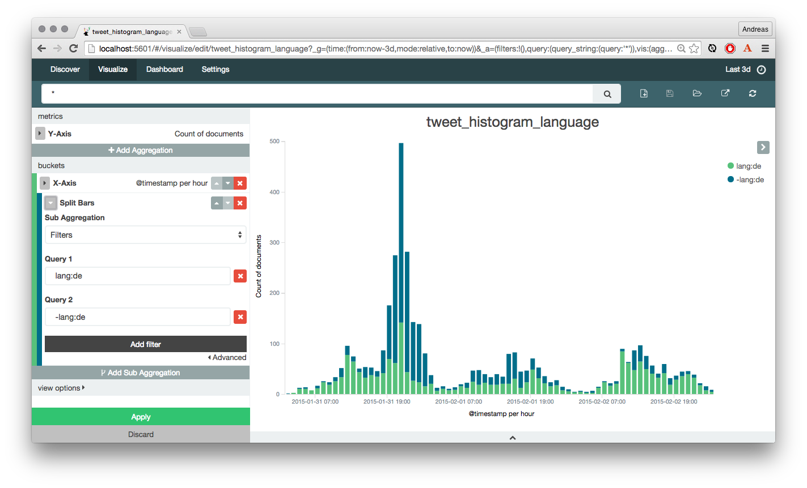

= Search Meetup Karlsruhe: Kibana 4

This repo contains the slides of my talk about Kibana 4 at the Search
Meetup Karlsruhe on January 29th 2015. Beside the slides there is also
the config required to run the live demo.

== Slides

Slides can be found at http://ajaegle.github.io/search-meetup-kibana.

== Showcase

The showcase demonstrates importing twitter data from the stream api
using the logstash twitter plugin. These tweets can then be analyzed using
kibana 4.

A mapping for the tweets structure is also available and has to be applied
before indexing data. This mapping is not to be seen as complete as only
selected fields are mapped to be searchable correctly. For full use of the
whole tweet structure, more fields have to be mapped correctly
(e.g. not_analyzed for user.url).

== Dependencies

- elasticsearch >= 1.4
- kibana 4 beta 3
- logstash 1.4.2

== Usage

- Setup and run elasticsearch
- Create the index by putting the mapping. (samples/twitter_mapping.txt)
- Create a new twitter application at https://apps.twitter.com/
- Obtain OAuth access token for your user
- Apply your twitter key/secret/oauth token to the logstash config
- Run `logstash-1.4.2/bin/logstash agent -f samples/logstash-twitter.conf`
- Extract kibana and edit config/kibana.yml to match your elasticsearch host
- Run `kibana/bin/kibana` and visit http://localhost:5601
